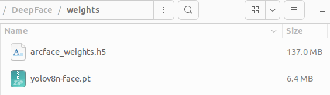

# deepface

<div align="center">

[Official Repo Hyperlink](https://github.com/serengil/deepface)

</div>

<p align="center"></p>

Deepface is a lightweight [face recognition](https://sefiks.com/2018/08/06/deep-face-recognition-with-keras/) and facial attribute analysis ([age](https://sefiks.com/2019/02/13/apparent-age-and-gender-prediction-in-keras/), [gender](https://sefiks.com/2019/02/13/apparent-age-and-gender-prediction-in-keras/), [emotion](https://sefiks.com/2018/01/01/facial-expression-recognition-with-keras/) and [race](https://sefiks.com/2019/11/11/race-and-ethnicity-prediction-in-keras/)) framework for python. It is a hybrid face recognition framework wrapping **state-of-the-art** models: [`VGG-Face`](https://sefiks.com/2018/08/06/deep-face-recognition-with-keras/), [`FaceNet`](https://sefiks.com/2018/09/03/face-recognition-with-facenet-in-keras/), [`OpenFace`](https://sefiks.com/2019/07/21/face-recognition-with-openface-in-keras/), [`DeepFace`](https://sefiks.com/2020/02/17/face-recognition-with-facebook-deepface-in-keras/), [`DeepID`](https://sefiks.com/2020/06/16/face-recognition-with-deepid-in-keras/), [`ArcFace`](https://sefiks.com/2020/12/14/deep-face-recognition-with-arcface-in-keras-and-python/), [`Dlib`](https://sefiks.com/2020/07/11/face-recognition-with-dlib-in-python/), `SFace` and `GhostFaceNet`.

[`Experiments`](https://github.com/serengil/deepface/tree/master/benchmarks) show that human beings have 97.53% accuracy on facial recognition tasks whereas those models already reached and passed that accuracy level.

## 실험했던 환경
- 윈도10, Python3.10.6, torch2.2.2, ultralytics8.2.28, tf2.8.4
- 우분투22.04, Python3.10.12, torch1.13.1, ultralytics8.2.23 / tf2.8.4
- 우분투22.04, Python3.10.12, torch2.3.1, ultralytics8.2.23 / tf2.8.4

## Installation

1. python3.10 설치
```shell
sudo apt install python3.10 python3.10-dev python3.10-venv
```

2. git clone
```shell
git clone https://github.com/XpertyCorp/DeepFace.git
```

3. 원하는 경로에 Virtualenv 생성
```shell
python3.10 -m venv venv
. venv/bin/activate
```

4. library install
```shell
cd DeepFace
pip install -r requirements.txt
```

5. Weight 다운로드 (TODO: 필요하다면 lfs 로 관리)
- 주소: https://works.do/GfiN1ks (웍스 드라이브, 사내구성원만 접속 가능)
- 저장 위치: ${DeepFace Root}/weights/
- 

## Inference (데모)
- 데모를 위한 샘플 이미지와 db vector 경로: ${ROOT}/tmp_data/
- 목적에 따라, 아래 셋 중 하나를 실행하면 됨
  - '1.detect_and_identification.py': 얼굴검출 (yolov8n) + 얼굴식별 (arcface)
  - '2.identification.py': 얼굴식별 (arcface)
  - '3.generate_db_vectors.py': (미완성) db vector 를 만드는 코드 (특정 폴더에 사진들 모아놓은 후 실행)
```shell
python 1.detect_and_identification.py
python 2.identification.py
```

## 사용한 라이브러리에 관해
- 코드 최적화 미완 상태이기 때문에, 향후 코드 추가 최적화 예정
- 현재 torch, tf, keras 등을 모두 설치하지만, 항상 모두 사용하는 것은 아님
  - 모두 설치하는 이유: 다양한 얼굴검출기와 얼굴식별기를 옵션으로 걸어놨는데, 모델마다 사용하는 라이브러리가 다르기 때문
  - 모델 선택과 finetuning 이 끝나면 불필요한 라이브러리 모두 제거 예정

## Licence

DeepFace is licensed under the MIT License - see [`LICENSE`](https://github.com/serengil/deepface/blob/master/LICENSE) for more details.

DeepFace wraps some external face recognition models: [VGG-Face](http://www.robots.ox.ac.uk/~vgg/software/vgg_face/), [Facenet](https://github.com/davidsandberg/facenet/blob/master/LICENSE.md) (both 128d and 512d), [OpenFace](https://github.com/iwantooxxoox/Keras-OpenFace/blob/master/LICENSE), [DeepFace](https://github.com/swghosh/DeepFace), [DeepID](https://github.com/Ruoyiran/DeepID/blob/master/LICENSE.md), [ArcFace](https://github.com/leondgarse/Keras_insightface/blob/master/LICENSE), [Dlib](https://github.com/davisking/dlib/blob/master/dlib/LICENSE.txt), [SFace](https://github.com/opencv/opencv_zoo/blob/master/models/face_recognition_sface/LICENSE) and [GhostFaceNet](https://github.com/HamadYA/GhostFaceNets/blob/main/LICENSE). Besides, age, gender and race / ethnicity models were trained on the backbone of VGG-Face with transfer learning. Similarly, DeepFace wraps many face detectors: [OpenCv](https://github.com/opencv/opencv/blob/4.x/LICENSE), [Ssd](https://github.com/opencv/opencv/blob/master/LICENSE), [Dlib](https://github.com/davisking/dlib/blob/master/LICENSE.txt), [MtCnn](https://github.com/ipazc/mtcnn/blob/master/LICENSE), [Fast MtCnn](https://github.com/timesler/facenet-pytorch/blob/master/LICENSE.md), [RetinaFace](https://github.com/serengil/retinaface/blob/master/LICENSE), [MediaPipe](https://github.com/google/mediapipe/blob/master/LICENSE), [YuNet](https://github.com/ShiqiYu/libfacedetection/blob/master/LICENSE), [Yolo](https://github.com/derronqi/yolov8-face/blob/main/LICENSE) and [CenterFace](https://github.com/Star-Clouds/CenterFace/blob/master/LICENSE). Finally, DeepFace is optionally using [face anti spoofing](https://github.com/minivision-ai/Silent-Face-Anti-Spoofing/blob/master/LICENSE) to determine the given images are real or fake. License types will be inherited when you intend to utilize those models. Please check the license types of those models for production purposes.

DeepFace [logo](https://thenounproject.com/term/face-recognition/2965879/) is created by [Adrien Coquet](https://thenounproject.com/coquet_adrien/) and it is licensed under [Creative Commons: By Attribution 3.0 License](https://creativecommons.org/licenses/by/3.0/).
